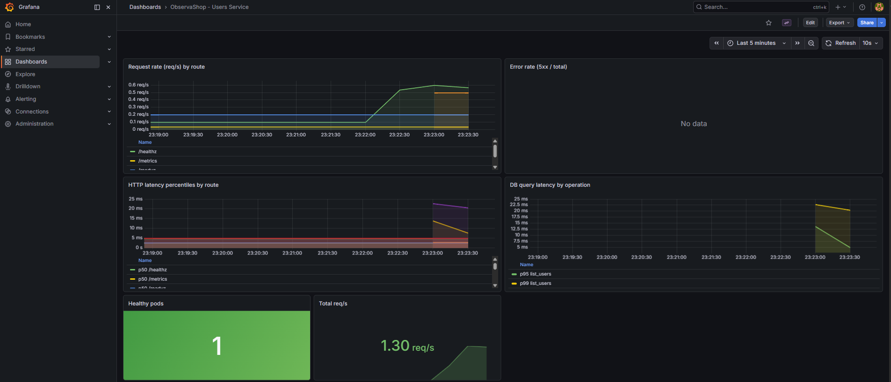
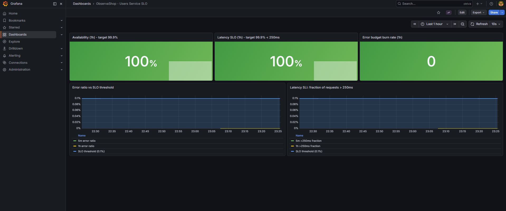
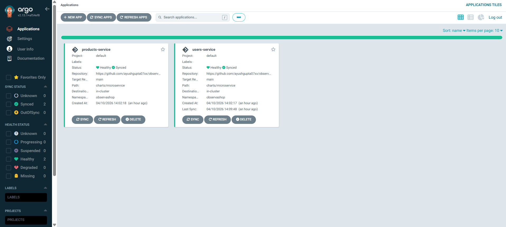
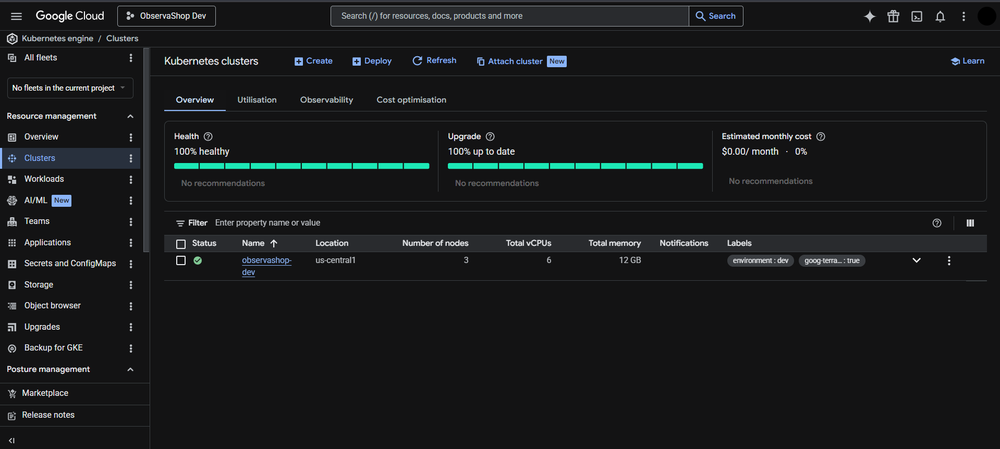
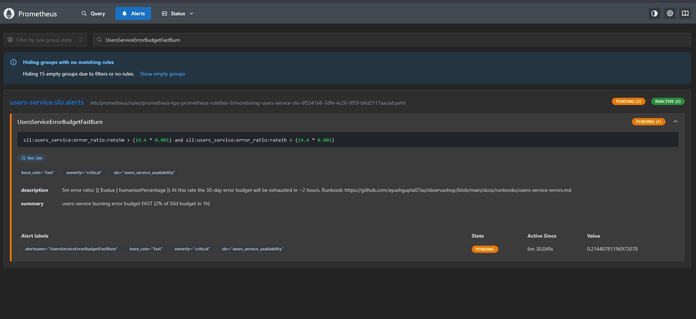
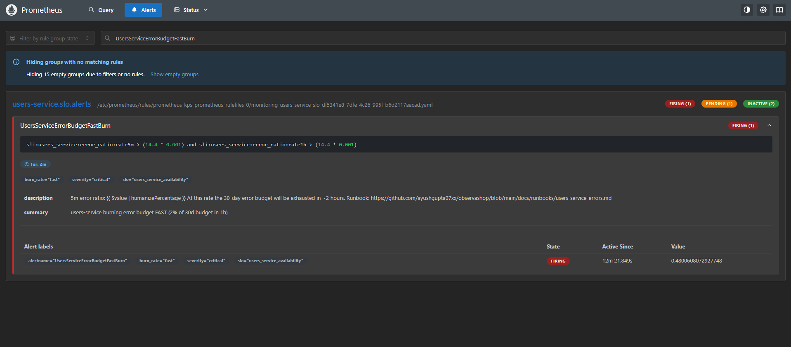
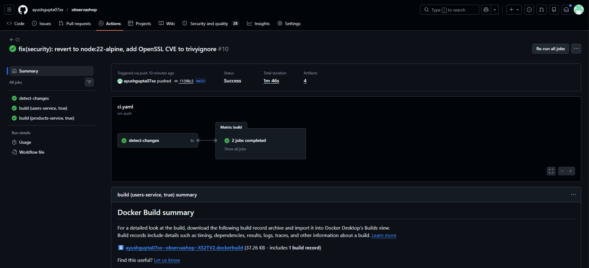
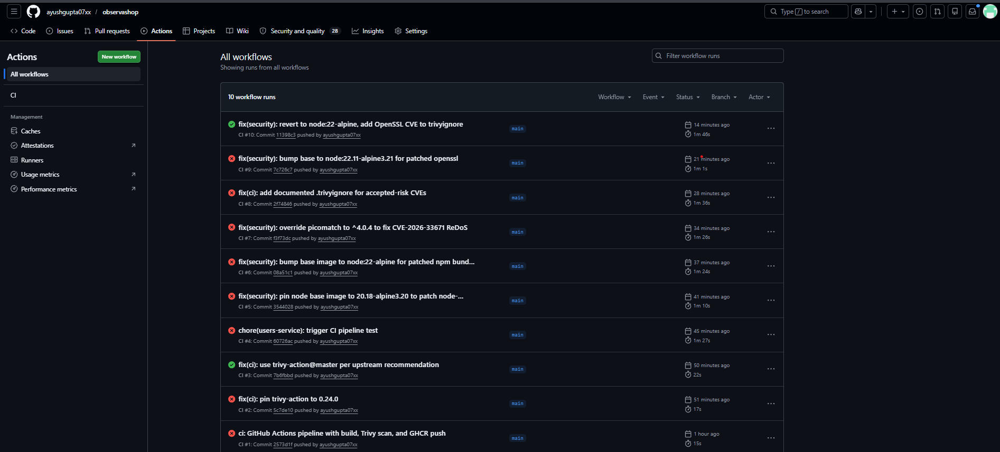
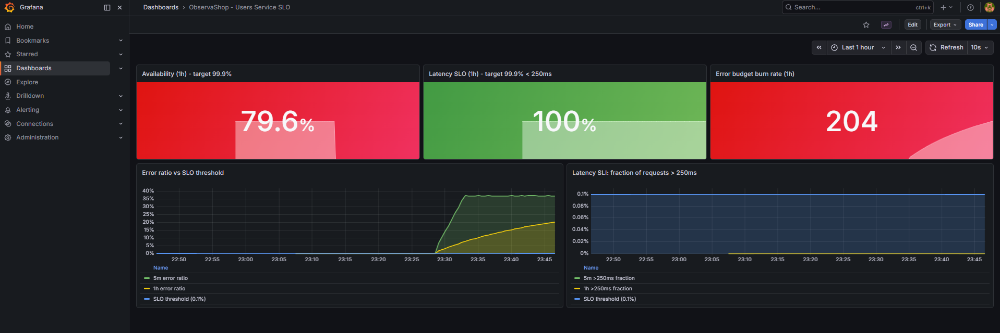

# ObservaShop

Production-grade microservice platform on Kubernetes — GitOps-managed, observability-first, SLO-gated, chaos-tested.

[](https://github.com/ayushgupta07xx/observashop/actions/workflows/ci.yaml)
[](LICENSE)


> A 12-day build demonstrating end-to-end DevOps / SRE practice: Kubernetes, Helm, ArgoCD, Prometheus/Grafana/Loki, multi-burn-rate SLO alerts, chaos engineering, Terraform + GKE, and a Go control-plane CLI.

---

## 🎥 3-minute demo

[](https://youtu.be/yEPA13Olrjs)

Walkthrough: provisioning GKE with Terraform, GitOps deployment via ArgoCD, live SLO dashboards, injecting chaos to trigger burn-rate alerts, and the incident-response flow end-to-end.

---

## What this is

ObservaShop is a portfolio project — a realistic microservice platform built the way production teams actually run Kubernetes, intentionally over-engineered for a student project because the over-engineering is the point. Three Node.js services behind a shared Helm chart, running on a 3-node `kind` cluster locally and on GKE in the cloud, managed end-to-end by ArgoCD, monitored with a full Prometheus/Grafana/Loki stack, gated by multi-burn-rate SLO alerts, and verified with runtime chaos injection.

Every decision — single reusable Helm chart, recording rules before alerts, readiness-vs-liveness probe split, `.trivyignore` entries with reachability analysis — is something a real platform engineer cares about. None of it is boilerplate.

---

## Highlights

| Capability | What's implemented |
|---|---|
| **Container orchestration** | `kind` (3 nodes, local) · GKE (Terraform-provisioned, cloud) |
| **Packaging** | Single reusable Helm chart parameterized per service |
| **GitOps** | ArgoCD with automated sync, self-heal, prune, ServerSideApply |
| **CI/CD** | GitHub Actions matrix builds · Trivy CVE gating · GHCR publish on `main` |
| **Observability** | kube-prometheus-stack · Loki v3 · Promtail · custom Grafana dashboards |
| **SLOs** | Multi-window multi-burn-rate alerts (Google SRE book: 14.4× / 6× / 3× / 1× burn) |
| **Chaos engineering** | Runtime fault injection (error-rate, latency) via in-service endpoints |
| **Infrastructure as Code** | Terraform modules for VPC, GKE cluster, node pool |
| **Supply-chain security** | Trivy scan gate · documented `.trivyignore` with reachability analysis |
| **Tooling** | `observashop-cli` — Go (cobra + client-go) for health, chaos, pods, SLO status |

---

## Screenshots

**Users-service dashboard** — request rate, error rate, p99 latency, live logs


**SLO dashboard** — availability and error-budget burn rate


**ArgoCD UI** — all applications synced and healthy


**GKE cluster** running ObservaShop (cloud deploy, Day 9)


---

## Architecture

See [docs/architecture.md](docs/architecture.md) for the full system diagram (Mermaid) and component reference.

High-level:

- **Services:** `users-service` (Postgres-backed CRUD), `products-service` (in-memory catalog), `orders-service` (fans out to users + products over HTTP)
- **Platform:** kube-prometheus-stack · Loki v3 · Promtail · ArgoCD · Postgres (Bitnami chart)
- **CI/CD:** GitHub Actions → Trivy → GHCR → ArgoCD auto-sync
- **Cloud:** Terraform-provisioned GKE (VPC, private cluster, node pool) with the same Helm charts

---

## Getting started

One-command local recreate:

```bash
./bootstrap.sh
```

This creates a 3-node `kind` cluster, wires up a local image registry, installs Postgres, deploys all three services via Helm, and installs the full observability stack and ArgoCD. Takes about 10 minutes from a clean machine.

The script itself is the detailed reference — each step is commented — see [`bootstrap.sh`](bootstrap.sh).

---

## Observability & SLOs

**What's monitored**
- HTTP request rate, error rate, and duration histograms via `prom-client`
- Structured JSON logs via `pino`, shipped to Loki by Promtail
- DB query latency (`db_query_duration_seconds`)
- Inter-service HTTP call latency (`http_client_request_duration_seconds`)
- Pod readiness and restart counts via kube-state-metrics

**How SLOs work here**
- Recording rules compute SLIs over 5m / 30m / 1h / 6h windows
- Alerts reference pre-computed SLIs (e.g. `sli:users_service:errors:rate5m`) instead of inlining raw PromQL histograms
- Multi-burn-rate pattern: a fast-burn alert (14.4× budget) **and** a slow-burn alert (1× budget) must both fire before paging — cuts false positives dramatically compared to naive threshold alerts
- Every alert carries a `runbook_url` annotation linking to the corresponding doc under [`docs/runbooks/`](docs/runbooks/)

**SLO targets**

| Service | Availability | p99 latency | Rationale |
|---|---|---|---|
| users-service | 99.9% | < 250 ms | Small synchronous DB round-trips |
| orders-service | 99.9% | < 500 ms | Higher budget because it fans out to 2 upstreams |

**Alert lifecycle — verified end-to-end**

Inactive → **Pending** → **Firing**, triggered by deliberate chaos injection:




See [docs/postmortem.md](docs/postmortem.md) for the full timeline of the injected chaos test — how the alert fired, what the runbook said to check, and how the system recovered.

---

## GitOps with ArgoCD

Git is the source of truth. After initial bootstrap, no one runs `helm install` or `helm upgrade` against managed releases — changes ship by merging to `main`.

- Three `Application` CRDs (one per service) in [`argocd/`](argocd/)
- `automated.prune: true` — manifests removed from Git are deleted from the cluster
- `automated.selfHeal: true` — manual `kubectl edit` reverts are reconciled back
- `ServerSideApply` — clean co-ownership with controllers


GitOps loop verified: changed `replicaCount: 2 → 3` in Git, cluster scaled within ~30 seconds, no manual intervention.

---

## CI/CD & supply-chain security

Pipeline: [`.github/workflows/ci.yaml`](.github/workflows/ci.yaml)

- **Path-filtered matrix:** only services with changed files build — PRs that touch one service don't rebuild all three
- **Multi-stage Docker builds:** non-root user, read-only root filesystem, minimal runtime layer
- **Trivy scan gate:** CRITICAL / HIGH CVEs block the build
- **GHCR publish:** on `main` only, tagged with the short commit SHA — never `latest` as a primary tag
- **`.trivyignore` policy:** every accepted-risk CVE must document package, severity, reachability analysis, risk level, and a review date



### The CVE remediation story

Trivy caught real CVEs across multiple iterations — `node-tar`, `picomatch`, `zlib`, `OpenSSL`. Each red ✗ below is a real vulnerability I had to either fix (base-image bumps, npm `overrides`) or accept with a documented reachability rationale:



The final commit is green. Everything in between is the work.

---

## Chaos engineering

Runtime fault injection via in-service endpoints on `users-service` — the same pattern Envoy and Istio use for real chaos in production, no external tool required:

```bash
# Inject 100% error rate
curl -X POST http://users-service/chaos/error-rate \
  -H 'content-type: application/json' -d '{"ratio": 1.0}'

# Inject 500ms latency on every request
curl -X POST http://users-service/chaos/latency \
  -H 'content-type: application/json' -d '{"ms": 500}'
```

**Verified end-to-end:** injected 100% error rate → `UsersServiceErrorBudgetFastBurn` transitioned Inactive → Pending → Firing within ~5 minutes, exactly as the multi-burn-rate math predicts.



Full timeline, root cause, and recovery steps: [docs/postmortem.md](docs/postmortem.md).

> LitmusChaos and Chaos Mesh are the production-grade equivalents of this pattern. I deliberately built the fault-injection endpoint in-service to understand the mechanism end-to-end before reaching for a framework.

---

## Runbooks

Every alert has a linked runbook. Click the `runbook_url` annotation in Alertmanager and you land on a doc with: symptoms, triage steps, diagnostic queries, likely causes, and recovery actions.

- [Users-service errors](docs/runbooks/users-service-errors.md)
- [Orders-service errors](docs/runbooks/orders-service-errors.md)
- [Upstream degraded](docs/runbooks/upstream-degraded.md)
- [Latency SLO burn](docs/runbooks/latency-slo-burn.md)
- [Pod not ready](docs/runbooks/pod-not-ready.md)

---

## Lessons learned

Five things that bit me, and what I took from each.

**1. `localhost:5001` in a `kind` cluster needs two containerd changes, not one.** The `hosts.toml` file alone isn't enough — containerd's main `config.toml` must also declare `config_path = "/etc/containerd/certs.d"` or every pull fails with `ImagePullBackOff: connection refused`. When a container can't pull an image, check the runtime config before blaming the network.

**2. Chart deprecation is a real reliability hazard.** The `loki-stack` chart (deprecated but still installable) ships Loki 2.6.1, which Grafana 12 can't health-check — the LogQL parser changed between major versions. Fix: migrate to the modern `grafana/loki` single-binary chart. "Latest chart" and "latest image" are not the same thing; always verify the image version your chart actually pins.

**3. Grafana datasource UIDs are auto-generated and do not match the human-readable name.** A dashboard JSON that hardcodes `"uid": "loki"` looks fine in an IDE and fails at runtime. Fix: query `/api/datasources` for the real UID and patch the ConfigMap. When declarative config cross-references another resource, verify the reference is by *identifier*, not *display label*.

**4. Trivy flags transitive dev dependencies that never ship to runtime.** `picomatch` showed up as HIGH because a test-time package pulled it in — but the runtime image is built with `npm ci --omit=dev`, so the vulnerable code physically isn't in the final layer. The fix wasn't to panic-bump every dep; it was to document in `.trivyignore` with a reachability analysis: "dev-only, confirmed absent via `docker history` inspection." Knowing the difference between *presence* and *reachability* is the security-engineering signal.

**5. Liveness and readiness probes serve different purposes.** Liveness asking "is the DB up?" creates cascading failures: DB has a 10-second blip, K8s kills every pod, startup takes 30 seconds — now the whole service is down for 30s instead of 10. Readiness should check dependencies (so traffic routes away); liveness should only check that the process itself hasn't wedged. Small config detail, huge outage-prevention payoff.

---

## Project journey — 12 days

| Day | Milestone |
|---|---|
| 1 | WSL2 + Docker Desktop + kubectl + kind + Helm + Terraform + GitHub repo |
| 2 | `users-service` (TS + Express 5) · hardened multi-stage Dockerfile · 3-node kind cluster |
| 3 | `products-service` added · local registry wired into kind · single reusable Helm chart · Postgres (Bitnami) with connection pool and migration retry |
| 4 | kube-prometheus-stack · Loki v3 · Promtail · custom Grafana dashboards · PrometheusRule with multi-burn-rate SLO alerts · chaos endpoints · end-to-end firing alert verified |
| 5 | ArgoCD with auto-sync / self-heal / prune · GitHub Actions CI · Trivy CVE gate · GHCR publish · real CVE remediation across 7 iterations |
| 6 | `orders-service` with inter-service HTTP calls · `OrdersServiceUpstreamDegraded` early-warning alert · orders SLO rules |
| 7 | `observashop-cli` — Go + cobra + client-go · four subcommands · in-cluster + local kubeconfig auto-detect |
| 8 | Terraform modules for VPC, GKE cluster, node pool · `plan`-only, no apply |
| 9 | `terraform apply` to real GKE · full stack deployed via the same Helm charts · demo video recorded · `terraform destroy` · $0 within GCP free tier |
| 10 | Postmortem doc · 5 runbooks · architecture diagram · alerts updated with `runbook_url` annotations |
| 11 | This README · `bootstrap.sh` one-command recreate · Terraform CI gates (`fmt -check`, `validate`) |
| 12 | Resume targeting DevOps + SRE roles |

---

## Repository layout

```
observashop/
├── services/                # 3 Node.js microservices + 1 Go CLI
├── charts/
│   ├── microservice/        # single reusable Helm chart
│   └── values/              # per-service values + observability configs
├── argocd/                  # ArgoCD Application CRDs
├── terraform/               # GKE + VPC + node pool modules
├── infra/
│   ├── kind/                # 3-node kind config
│   └── scripts/             # local registry setup
├── docs/
│   ├── architecture.md      # system diagram + component reference
│   ├── postmortem.md        # chaos-test incident writeup
│   ├── runbooks/            # 5 alert runbooks
│   └── images/              # screenshots
├── .github/workflows/       # CI matrix + Trivy + GHCR
└── bootstrap.sh             # one-command local recreate
```

---

## Author

**Ayush Gupta** — Computer Science undergrad (May 2026 graduate), targeting DevOps / SRE / backend engineering roles.

[LinkedIn](https://linkedin.com/in/ayush-gupta-544a803a2) · [GitHub](https://github.com/ayushgupta07xx)

---

*Built over 12 days in April 2026. MIT licensed. Questions, feedback, and job offers all welcome.*
