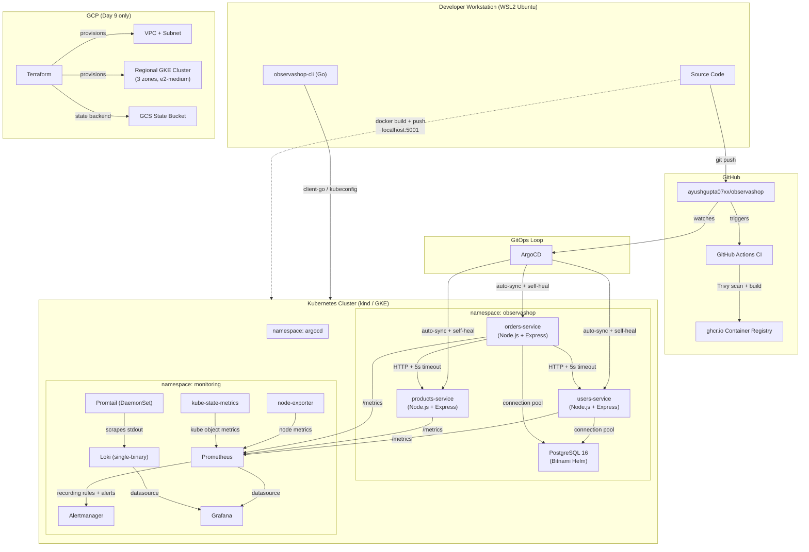

# ObservaShop — System Architecture

## Overview

ObservaShop is a microservice platform deployed on Kubernetes with full observability, GitOps-driven delivery, and SLO-based alerting. It runs on two deployment targets: a local kind cluster for development and a regional GKE cluster on GCP for production-grade validation.

## Architecture diagram



## Deployment targets

### Local (kind)

The default development environment. A 3-node kind cluster (1 control plane + 2 workers) running Kubernetes v1.30 on Docker Desktop via WSL2. Images are pushed to a local `registry:2` container at `localhost:5001` wired into the kind Docker network.

Full stack: 3 application services + PostgreSQL + kube-prometheus-stack + Loki + Promtail + ArgoCD. Rebuild from scratch takes ~30 minutes (will be automated by `bootstrap.sh` on Day 11).

### Cloud (GKE)

Used on Day 9 for production-grade validation. Regional GKE cluster in `us-central1` (HA control plane across 3 zones) provisioned by Terraform. Managed node pool with dedicated least-privilege service account, Workload Identity, shielded nodes, and Calico network policy.

Infrastructure is ephemeral — `terraform apply` to create, `terraform destroy` when done. Total Day 9 spend: ~$0.65 USD on GCP trial credit.

## Service architecture

| Service | Language | Database | Endpoints | SLO |
| --- | --- | --- | --- | --- |
| users-service | Node.js 20 + TypeScript | PostgreSQL (`users` DB) | CRUD + `/healthz` + `/readyz` + `/metrics` + `/chaos/*` | 99.9% availability, p99 < 250ms |
| products-service | Node.js 20 + TypeScript | In-memory | CRUD + `/healthz` + `/readyz` + `/metrics` | — |
| orders-service | Node.js 20 + TypeScript | PostgreSQL (`orders` DB) | CRUD + `/healthz` + `/readyz` + `/metrics` | 99.9% availability, p99 < 500ms |
| observashop-cli | Go 1.25 | — | `health`, `chaos`, `pods`, `slo-status` subcommands | — |

### Inter-service communication

orders-service makes synchronous HTTP calls to users-service and products-service to validate user and product existence before creating an order. Calls use a 5-second `AbortSignal.timeout`. Failures are tracked by the `http_client_request_duration_seconds` histogram and the `OrdersServiceUpstreamDegraded` alert.

## Observability stack

### Metrics pipeline

```
Services (prom-client) → /metrics endpoint → Prometheus scrape (30s interval)
  → Recording rules (SLI computation over 5m/30m/1h/6h windows)
  → Multi-window multi-burn-rate alerts (Google SRE book pattern)
  → Alertmanager
```

Key metrics:
- `http_requests_total` — request count by service, method, status
- `http_request_duration_seconds` — request latency histogram
- `db_query_duration_seconds` — database query latency histogram
- `http_client_request_duration_seconds` — outbound HTTP call latency (orders-service)

### Logs pipeline

```
Container stdout → Promtail DaemonSet → Loki (single-binary, v3) → Grafana Explore
```

Services log structured JSON via `pino`. Promtail scrapes container stdout from every node and ships to Loki.

### Dashboards

Two custom Grafana dashboards deployed as ConfigMaps (survive pod restarts):
1. **ObservaShop - Users Service** — request rate, error rate, latency percentiles, DB query latency, healthy pods, live log panel
2. **ObservaShop - SLO Dashboard** — availability percentage, latency compliance, error-budget burn rate for users-service and orders-service

### Alerting

9 alerts across 2 PrometheusRule CRDs (`slo-rules.yaml`, `slo-rules-orders.yaml`):

| Alert | Type | Severity |
| --- | --- | --- |
| `UsersServiceErrorBudgetFastBurn` | Availability burn rate | critical |
| `UsersServiceErrorBudgetSlowBurn` | Availability burn rate | warning |
| `UsersServiceLatencySLOFastBurn` | Latency burn rate | critical |
| `UsersServicePodNotReady` | Health | critical |
| `OrdersServiceErrorBudgetFastBurn` | Availability burn rate | critical |
| `OrdersServiceErrorBudgetSlowBurn` | Availability burn rate | warning |
| `OrdersServiceLatencySLOFastBurn` | Latency burn rate | critical |
| `OrdersServicePodNotReady` | Health | critical |
| `OrdersServiceUpstreamDegraded` | Dependency early-warning | warning |

All alerts use recording rules (`sli:*`) as inputs — raw PromQL histograms are never inlined in alert expressions.

## CI/CD pipeline

```
git push to main
  → GitHub Actions triggers
  → Matrix build (one job per service, path-filtered)
  → npm install + tsc build (Node services) / go build (CLI)
  → docker build (multi-stage, hardened)
  → Trivy scan (gate on CRITICAL/HIGH, .trivyignore for accepted risk)
  → docker push to ghcr.io (tagged with short commit SHA)
  → ArgoCD detects drift → auto-sync to cluster
```

The CI matrix carries a `language` field (`node` or `go`) so language-specific build steps only run for the services that need them.

## Helm packaging

All three application services use a single reusable Helm chart (`charts/microservice/`) parameterized by per-service values files (`charts/values/<service>.yaml`). This mirrors how real platform teams ship internal services — one chart template, many instances.

Infrastructure components (PostgreSQL, kube-prometheus-stack, Loki, Promtail, ArgoCD) use upstream community Helm charts with custom values overrides.

## Terraform (GCP infrastructure)

```
terraform/
├── modules/
│   ├── vpc/    # VPC + subnet with secondary ranges for VPC-native GKE
│   └── gke/    # Regional cluster + managed node pool + SA + IAM
└── environments/
    └── dev/    # Composition wiring modules together
```

State stored in GCS bucket with versioning enabled. Provider pinned to `google ~> 6.0`, Terraform `>= 1.9.0`.
